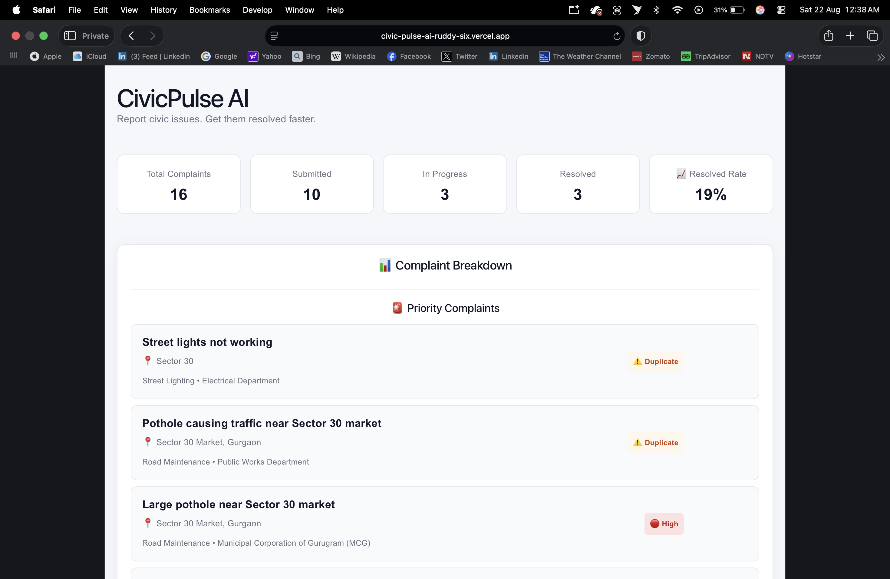
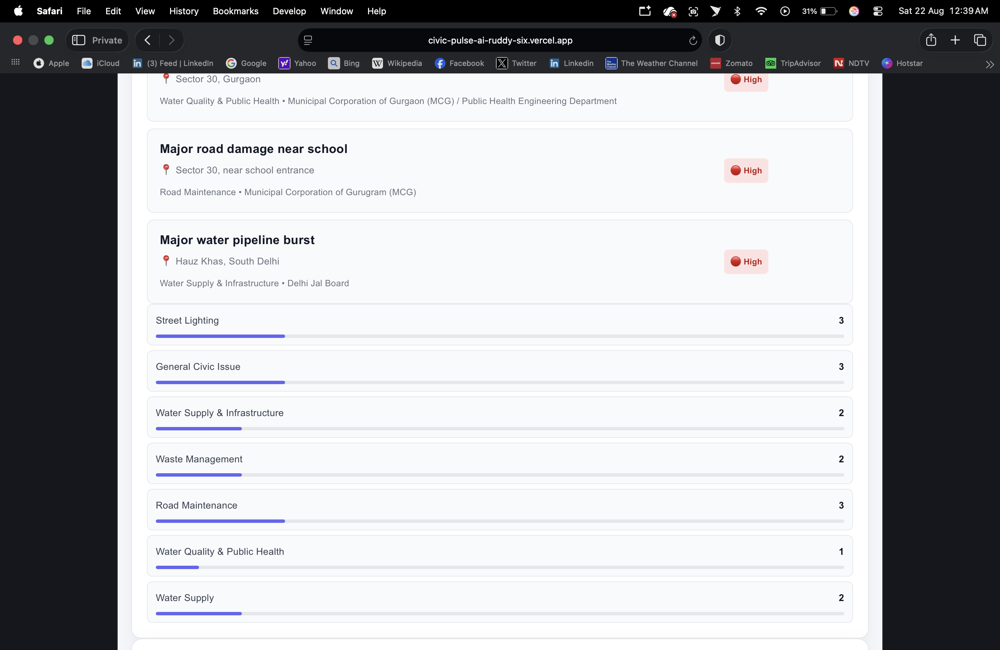
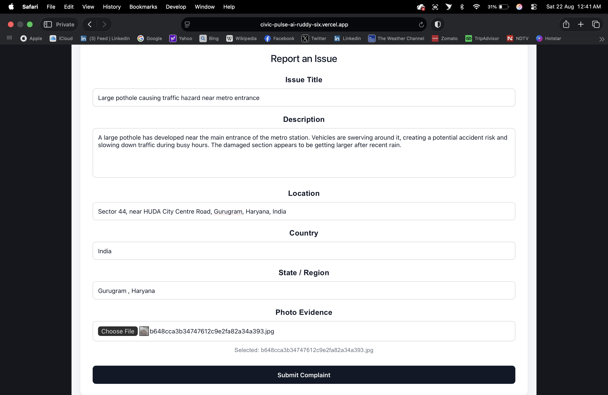
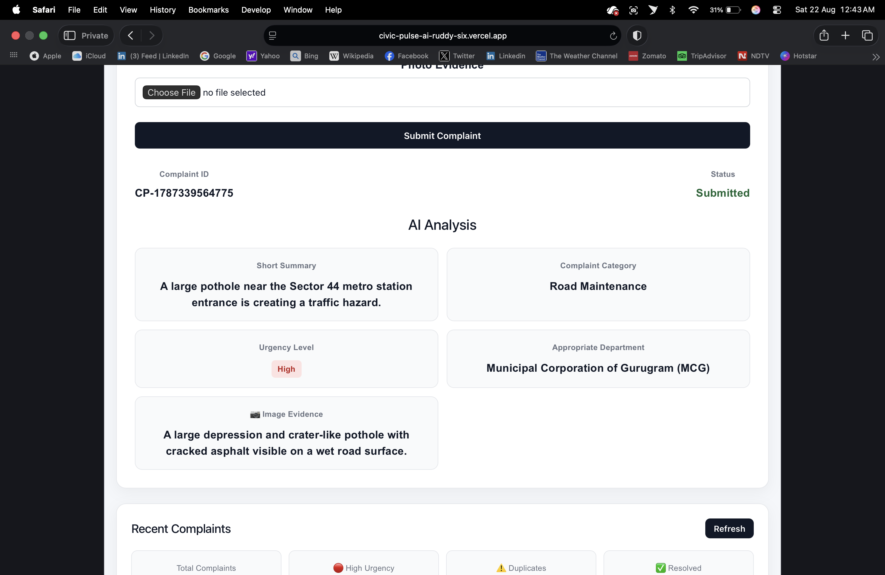
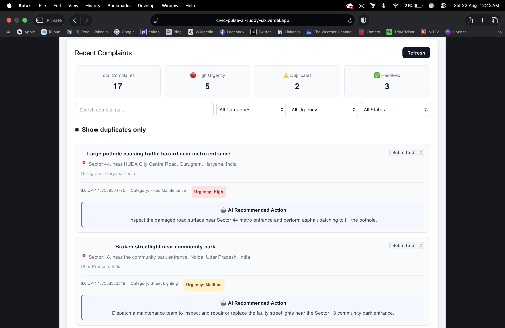
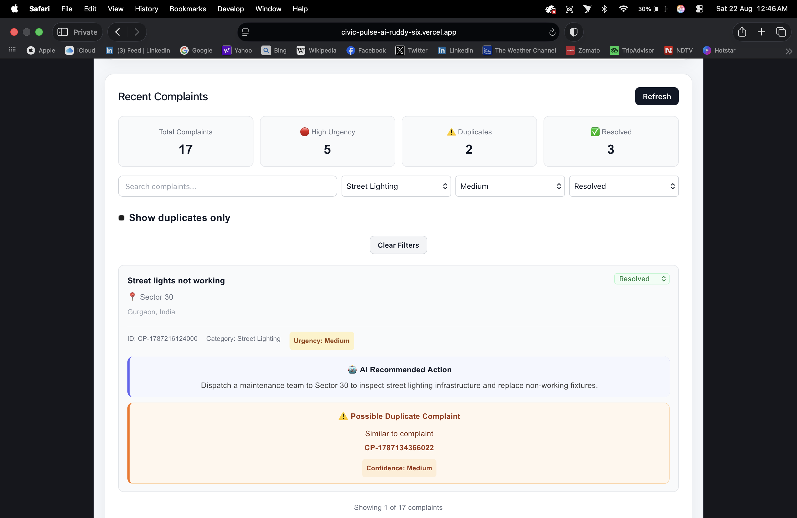

# CivicPulse AI

> AI-powered civic complaint management system that analyzes, prioritizes, and tracks public complaints.

## 🚀 Live Demo

https://civic-pulse-ai-ruddy-six.vercel.app

## 📌 About

CivicPulse AI is a full-stack civic complaint platform designed to make reporting and managing public issues easier.

Users can submit complaints with descriptions, locations, and optional photo evidence. The system uses Google Gemini to analyze each complaint, determine its category and urgency, recommend the appropriate department, and detect possible duplicate complaints.

## ✨ Features

- 📝 Submit civic complaints
- 📍 Location-based complaint information
- 📷 Upload photo evidence
- 🤖 AI-powered complaint analysis
- 🚨 Automatic urgency detection
- 🏷️ Complaint categorization
- 🏢 Department recommendation
- ⚠️ Duplicate complaint detection
- 📊 Complaint analytics dashboard
- 🔍 Search complaints
- 🎯 Filter by category, urgency, and status
- 🔄 Update complaint status
- 📱 Responsive design for desktop and mobile
- ☁️ Deployed frontend and backend

## 🤖 AI Analysis

Google Gemini analyzes submitted complaints and generates:

- Short summary
- Complaint category
- Urgency level
- Appropriate department
- Recommended action
- Image evidence analysis
- Duplicate complaint detection

## 🛠️ Tech Stack

### Frontend

- React
- Vite
- CSS

### Backend

- Node.js
- Express.js
- Multer

### AI

- Google Gemini API

### Database

- Firebase Firestore

### Deployment

- Vercel — Frontend
- Render — Backend

## 🏗️ Architecture

```text
User
  ↓
React + Vite
  ↓
Vercel
  ↓
Node.js + Express
  ↓
Google Gemini
  ↓
Firebase Firestore

## 📸 Screenshots

### Dashboard


### Complaint Analytics


### Report an Issue


### AI Analysis


### Recent Complaints


### Complaint Filters

